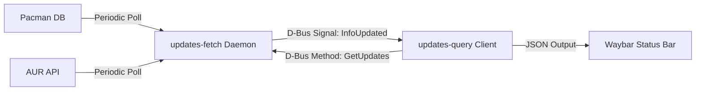

<!-- markdownlint-disable MD013 -->
# Waybar Updates Btw

[](https://go.dev/)
[](LICENSE)

`waybar-updates-btw` is a high-performance, lightweight update notifier module for [Waybar](https://github.com/Alexays/Waybar) (and other status bars like Polybar) on Arch Linux.

Unlike traditional status bar update scripts that check package databases synchronously on every refresh—causing lags, network overhead, and database locks—this project uses a **split client-server architecture** running over the **D-Bus Session Bus**.

---

## Architecture & How It Works

This project is split into two components:

1. **`updates-fetch` (Daemon):** A persistent user daemon that runs in the background. It manages an in-memory cache of updates and polls for Pacman and AUR updates periodically. It registers as a D-Bus service (`org.lmcs.DBus.UpdatesBtw`) and emits a signal (`InfoUpdated`) whenever updates change.
2. **`updates-query` (Client):** A quick CLI query tool invoked by Waybar. It queries the daemon via D-Bus, formats the list of updates in columns, color-codes them by version change type (major, minor, patch, pre, other), and outputs JSON. It also subscribes to the D-Bus signal to instantly refresh when updates are found.



### Key Features

* **Zero Lag:** Updates are fetched asynchronously by the daemon. The client retrieves cached updates via D-Bus instantly.
* **No Database Locks:** Utilizes the safe `checkupdates` script under the hood, which operates on a temporary database directory.
* **Smart Version Coloring:** Compares old and new version strings to color-code updates based on whether they are major, minor, patch, or revision updates.
* **Clean Column Alignment:** Tooltip aligns packages and versions into neat, monospaced columns.
* **Push Notifications:** The client listens for D-Bus signals so that the bar UI updates *instantly* the moment the daemon detects a change.

---

## Installation

### Prerequisites

Ensure you have the following tools installed on your Arch system:

* `go` (>= 1.25.3 to compile)
* `pacman` (obviously)
* `pacman-contrib` (provides the `checkupdates` utility)

### Compilation

Clone the repository and compile the binaries:

```bash
git clone https://github.com/lmcanavals/waybar-updates-btw.git
cd waybar-updates-btw

# Build the binaries
go build -o build/updates-fetch ./cmd/updates-fetch
go build -o build/updates-query ./cmd/updates-query
```

After compilation, copy the binaries into your system path (e.g., `~/.local/bin/` or `/usr/local/bin/`):

```bash
cp build/updates-fetch ~/.local/bin/
cp build/updates-query ~/.local/bin/
```

---

## Configuration & Run Guide

### 1. Daemon Setup (`updates-fetch`)

The background daemon must be running in your user session. The best way to manage it is using a systemd user service.

Create a systemd service file at `~/.config/systemd/user/updates-fetch.service`:

```ini
[Unit]
Description=Waybar Updates Btw Background Daemon
After=network.target

[Service]
ExecStart=%h/.local/bin/updates-fetch
Restart=on-failure
RestartSec=5s

[Install]
WantedBy=default.target
```

Enable and start the service:

```bash
systemctl --user daemon-reload
systemctl --user enable --now updates-fetch.service
```

### 2. Client Setup (`updates-query`)

Test that the client can communicate with the daemon:

```bash
updates-query
```

It should instantly return a JSON payload resembling:

```json
{"text":"󰮯 5","tooltip":"linux   6.9.1.arch1-1 -> 6.9.2.arch1-1\nayay    12.3.5-1      -> 12.3.6-1","class":"has-updates","alt":"has-updates"}
```

#### Command-Line Flags

You can customize `updates-query` output and color scheme using flags:

| Flag | Default | Description |
| :--- | :--- | :--- |
| `-interval` | `120` | Interval between active D-Bus queries in seconds. |
| `-raw-output` | `false` | Disables formatting the tooltip text into aligned columns. |
| `-no-color` | `false` | Disables coloring packages by version change category. |
| `-color-major` | `f7768e` | Hex color code for major version changes (default: Tokyo Night red). |
| `-color-minor` | `ff9e64` | Hex color code for minor version changes (default: Tokyo Night orange). |
| `-color-patch` | `e0af68` | Hex color code for patch updates (default: Tokyo Night yellow). |
| `-color-pre` | `9ece6a` | Hex color code for revision/pre updates (default: Tokyo Night green). |
| `-color-other` | `7dcfff` | Hex color code for other version bumps (default: Tokyo Night blue). |

### 3. Waybar Integration

Add the custom module to your Waybar configuration (usually `~/.config/waybar/config.jsonc` or `~/.config/waybar/config`):

```json
"custom/updates": {
    "format": "{}",
    "exec": "~/.local/bin/updates-query",
    "return-type": "json",
    "restart-interval": 0, // D-Bus will automatically trigger refreshes
    "on-click": "kitty -e yay -Syu" // Or your favorite terminal and AUR helper
}
```

Add styling to your Waybar stylesheet (`~/.config/waybar/style.css`):

```css
#custom-updates {
    color: #c0caf5;
    background: #1a1b26;
    padding: 0 10px;
    border-radius: 4px;
}

#custom-updates.has-updates {
    color: #ff9e64; /* Highlight style when updates are available */
}

#custom-updates.updated {
    color: #9ece6a; /* Style when fully updated */
}
```

---

## DBus API Specifications

For developers looking to integrate other tools or write their own frontends, the daemon exposes the following interface:

* **Bus Name:** `org.lmcs.DBus.UpdatesBtw`
* **Object Path:** `/org/lmcs/DBus/UpdatesBtw/GetUpdates`
* **Interface:** `org.lmcs.DBus.UpdatesBtw.UpdatesInterface`

### Methods

#### `GetUpdates(clientVersion int64) (string, error)`

Retrieves available updates.

* If the `clientVersion` passed matches the current version tracked by the daemon, it returns a lightweight JSON response with `"changed": false` and excludes the package array.
* If a new version is available, it returns the full updates list and `"changed": true`.

### Signals

#### `InfoUpdated(version int64)`

Fires whenever the package lists (Pacman or AUR) change, indicating a new state version.

---

## License

This project is licensed under the MIT License - see the [LICENSE](LICENSE) file for details.
